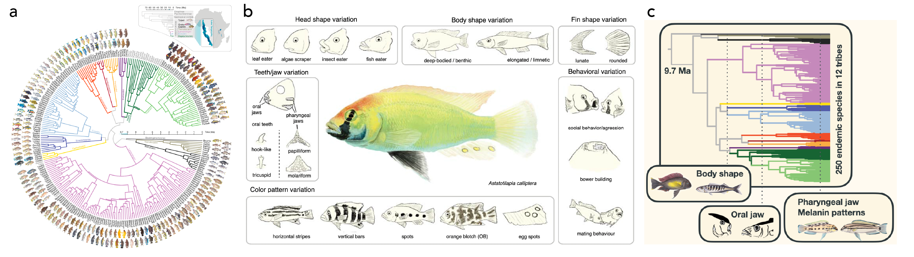
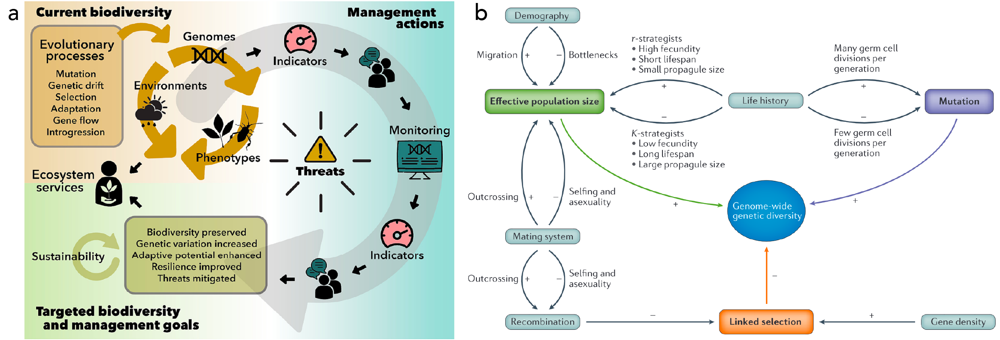
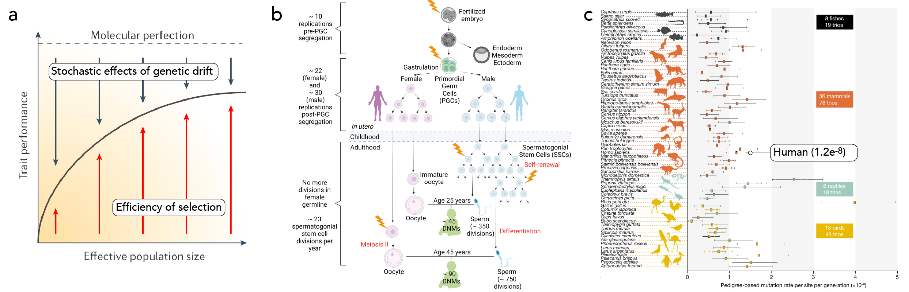
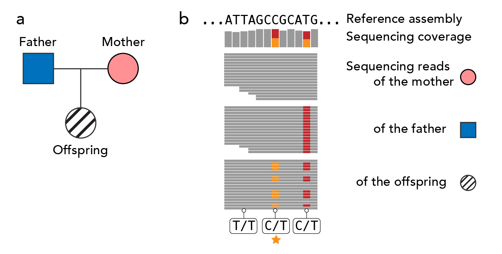
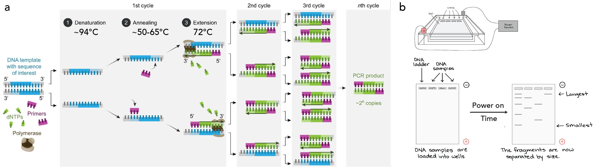
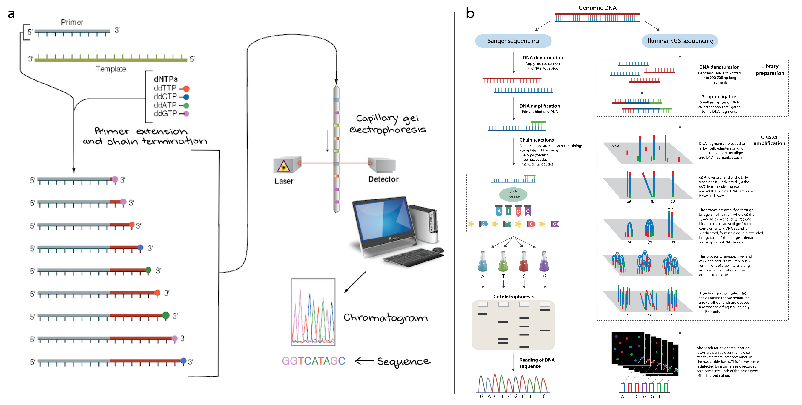
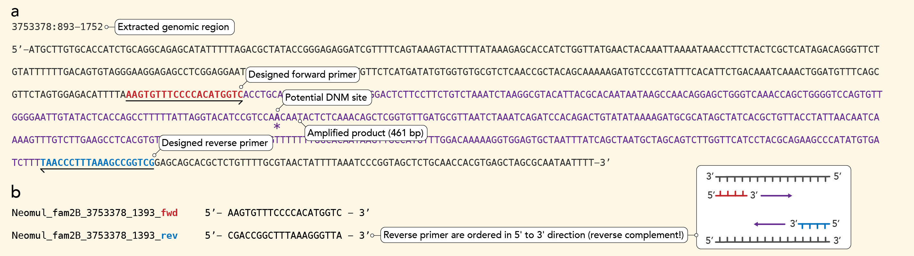

# Experimental validation of *de novo* mutations 

## Outline
[Abstract](#abstract)  
[Background and literature](#background-and-literature)  
[The project: verification of DNMs using Sanger sequencing](#the-project)
[Schedule](#schedule)  
[Practical steps](#practical-steps)  

<a name="abstract"></a>
## Abstract

Biodiversity, representing all life forms on Earth and providing essential resources, is threatened by rapid human population growth and associated habitat and climate change, ultimately leading to species extinction and the depletion of biodiversity. The molecular basis underlying all biodiversity is genetic diversity – the variation of DNA molecules carrying information for the development of nearly all organisms. Higher genetic diversity increases the likelihood of individuals to possess advantageous variants, aiding their survival and reproduction amidst changing environments. The most direct source of novel genetic diversity are germline mutations, alterations occurring in the cells developing into eggs and sperm. However, the extent to which the rate of germline mutations varies among species and its measurable impact on genetic diversity has so far remained elusive. Recent advances in DNA sequencing and analyses now permit the direct detection of germline mutations in non-model organism, enabling comparative studies among species. These techniques use whole-genome sequencing (WGS) data of parents and offspring to quantify the per generation germline mutation rates. Yet, despite stringent bioinformatic filtering pipelines, high error rates in WGS data still inherit the risk of detecting false positive mutations. In this ‘Block course’ project, we will validate *de novo* mutations identified in family WGS data of different species of African Lake Tanganyika cichlid fishes using Sanger sequencing and calculate the false positive detection rate. The practical part of the project will involve bioinformatic tasks, primer design, laboratory work (polymerase chain reaction, gel electrophoresis, Sanger sequencing), analysis of electropherograms, and statistics. Outcomes of this project will aid the evaluation of *de novo* mutation rates from WGS data, allowing to better understand the determinants of genetic diversity, and ultimately help to establish genetic diversity as conservation management tool.

<a name="background-and-literature"></a>
## Background and literature

### African Lake Tanganyika cichlid fishes

Lake Tanganyika, one of the oldest freshwater lakes in the world (~10 million years old), and  — by means of water volume — the largest of the African Great Lakes, harbors the phenotypically, ecologically, and behaviorally most diverse cichlid fish assemblage in Africa. Often cited as the most diverse of all adaptive radiations this species flock is a highly interesting system to study evolutionary questions.

<kbd></kbd>
**Fig.1** Cichlid diversity **(a)** Time-calibrated phylogenetic relationships of Lake Tanganyika cichlids ([Ronco et al. 2020](https://doi.org/10.1016/j.jglr.2019.05.009)) **(b)** Trait axes of divergence in cichlid fishes ([Santos et al. 2023](https://doi.org/10.1186/s13227-022-00205-5)) **(c)** Timeline of bursts of morphological evolution (modified from [Ronco and Salzburger 2021](https://doi.org/10.1016/j.zool.2021.125925)). CC BY-NC-SA 4.0

Food for conceptual thoughts: 
 
- What is an adaptive radiation, what are examples of adaptive radiations, how do they differ and what do they have in common?
- Why are some clades across the Tree of Life extraordinary species-rich, while others seem to remain in morphological stasis and have low diversity?

**Literature:**

- African cichlid diversity in the genomics era: Salzburger (2018) *Understanding explosive diversification through cichlid fish genomics*. Nat Rev Genet 19, 705-717 ([https://doi.org/10.1038/s41576-018-0043-9](https://doi.org/10.1038/s41576-018-0043-9))*

- Overview of Lake Tanganyika cichlid species and tribes: Ronco et al. (2020) *The taxonomic diversity of the cichlid fish fauna of ancient Lake Tanganyika, East Africa*. J Great Lakes Res 46, 1067-1078 ([https://doi.org/10.1016/j.jglr.2019.05.009](https://doi.org/10.1016/j.jglr.2019.05.009))

- Biogeography of the African Great Lakes: Salzburger et al. (2014) *Ecology and evolution of the African Great Lakes and their faunas*. Annu Rev Ecol Evol Syst 45, 519-545 ([https://doi.org/10.1146/annurev-ecolsys-120213-091804](https://doi.org/10.1146/annurev-ecolsys-120213-091804))

- Diversification of Lake Tanganyika cichlid species: Ronco et al. (2020) *Drivers and dynamics of a massive adaptive radiation in cichlid fishes*. Nature 589, 76-81 ([https://doi.org/10.1038/s41586-020-2930-4](https://doi.org/10.1038/s41586-020-2930-4))


### Biodiversity, genetic diversity, and conservation

In his seminal work 'On the origin of species', Charles Darwin elucidate the process by which Earth’s ‘endless forms most beautiful and most wonderful have been, and are being evolved’. More than a century later, the identification of the underlying factors influencing biodiversity is still a challenge. Biodiversity is tightly interlinked with genetic diversity, that is, the variation within a single species. Particularly in situations of environmental disturbances – including man-made ones such as climate change – the resilience of ecosystems depends on the ability of species to rapidly adapt to altered conditions, which is in turn facilitated by genetic diversity. Consequently, assessing genetic diversity is a key aspect in the management and conservation of biodiversity today.

<kbd></kbd>
**Fig.2** Interconnections among biodiversity, genetic diversity, and conservation **(a)** Application of genomics in conservation and ecosystem service management is successful, but limited through lack of communication ([Heuertz et al. 2023](https://doi.org/10.1016/j.biocon.2022.109883)) **(b)** Determinants of genetic diversity ([Ellegren and Galtier 2016](https://doi.org/10.1038/nrg.2016.58](https://doi.org/10.1038/nrg.2016.58))). CC BY-NC-SA 4.0

Food for conceptual thoughts: 

- What are factors that determine species-richness and biodiversity?
- Is hybridization rather reverting speciation through the merging of two species into one, or does the genetic exchange of genetic diversity promote speciation?

**Literature:**

- A review about determinants of genetic diversity: Ellegren and Galtier (2016) *Determinants of genetic diversity*. Nat Rev Genet 17, 422-433 ([https://doi.org/10.1038/nrg.2016.58](https://doi.org/10.1038/nrg.2016.58))*

- Genomics for maintaining and improving ecosystem services: Stange et al. (2021) *The importance of genomic variation for biodiversity, ecosystems and people*. Nat Rev Genet 22, 89-105 ([https://doi.org/10.1038/s41576-020-00288-7](https://doi.org/10.1038/s41576-020-00288-7))

- From history to recent developments in Conservation Biology: Willi et al. (2021) *Conservation genetics as a management tool: The five best-supported paradigms to assist the management of threatened species*. Proc Natl Acad Sci USA 119, e2105076119 ([https://doi.org/10.1073/pnas.2105076119](https://doi.org/10.1073/pnas.2105076119))

- Genetic diversity in politics: Hoban et al. (2023) *Genetic diversity goals and targets have improved, but remain insufficient for clear implementation of the post‑2020 global biodiversity framework*. Conserv Genet 24, 181-191 ([https://doi.org/10.1007/s10592-022-01492-0](https://doi.org/10.1007/s10592-022-01492-0))


### Germline *de novo* mutations (DNMs)

Germline *de novo* mutations (DNMs) are the ultimate source of novel genetic variation. According to the neutral theory of molecular evolution, both the rate of new mutations and the population size positively influence genetic diversity. This is because most DNMs are assumed to be neutral and a larger population size reduces the effects of genetic drift. Many DNMs result from errors during DNA replication. In humans, the contribution of DNMs from the father is therefore higher than from the mother and increases with age. Yet, proofreading subunits and mismatch repair complexes can lower the polymerase error rate. Further sources of DNMs are exogenous or endogenous mutagens, such as UV light. Germline DNMs are only those mutations, that are present for the first time in a germ cell (sperm or egg) and are thus inherited to all cells of the offspring. In contrast, somatic mutations arise later in development, are restricted to somatic cells and tissues and are not passed on to offspring. Although here we focus on germline single-nucleotide mutations – constituting the largest fraction of DNMs – also indels (insertions/deletions) or copy-number variants can originate *de novo*. Generally, the DNM rate is very small, with about 1.2 x 10<sup>-8</sup> mutations per bp per generation in humans. If multiplied with the human genome size (~ 3.055 x 10<sup>9</sup> bp), we can estimate the number of new mutations in each child to be about 73.

<kbd></kbd>
**Fig.3** De novo mutations **(a)** The drift-barrier hypothesis for mutation rate proposes that natural selection pushes towards molecular perfection, while random genetic drift works against it. Therefore, large populations are predicted to have lower DNM rates than smaller populations. However, a "perfect" mutation rate (i.e., zero) can never be reached as the lack of DNMs would imply no variation for selection to act on ([Lynch et al. 2016](https://doi.org/10.1038/nrg.2016.104)). **(b)** Germ cell replication differences in human females versus males explains bias in DNM contribution to offspring ([Wood and Goriely 2022](https://doi.org/10.1016/j.fertnstert.2022.10.017)). **(c)** Overview of the DNM rates across vertebrates estimated using trio sequencing showed that fishes tend to have a lower DNM rate compared to mammals, birds, and reptiles ([Bergeron et al. 2023](https://doi.org/10.1038/s41586-023-05752-y)). CC BY-SA 4.0

Food for conceptual thoughts: 

- Can life history differences (e.g., age at first reproduction, oviparity/viviparity, parental care, fecundity, *etc*.) impact the rate of DNMs?
- For fish, can we also expect a bias towards more mutation with pronounced parental age and a higher contribution from males?
- Can differences in the germline mutation rate shape genetic diversity and impact speciation?

**Literature:**

- Lynch et al. (2016) *Genetic drift, selection and the evolution of the mutation rate*. Nat Rev Genet 17, 704–714 ([https://doi.org/10.1038/nrg.2016.104](https://doi.org/10.1038/nrg.2016.104))*

- Acuna-Hidalgo et al. (2016) *New insights into the generation and role of de novo mutations in health and disease*. Genome Biol 17, 241 ([https://doi.org/10.1186/s13059-016-1110-1](https://doi.org/10.1186/s13059-016-1110-1))

- Wang and Obbard (2023) *Experimental estimates of germline mutation rate in eukaryotes: a phylogenetic meta-analysis*. Evol Lett 7, 216-226 ([https://doi.org/10.1093/evlett/qrad027](https://doi.org/10.1093/evlett/qrad027))

- Bergeron et al. (2023) *Evolution of the germline mutation rate across vertebrates*. Nature 615, 285–291 ([https://doi.org/10.1038/s41586-023-05752-y](https://doi.org/10.1038/s41586-023-05752-y))


### Parent-offspring sequencing for detection of DNMs

Since the completion of the Human Genome Project in 2003, where the first nearly complete (92%) sequence of the human genome was generated using the Sanger sequencing method (see below), new technologies for sequencing have been developed and hence named "next-generation" sequencing (NGS) methods. The new methods lowered the costs and efficiency drastically and many more samples can now be sequenced, yet, the error rate is higher and reads are shorter (about 0.2% error rate and 150 bp length for short-read Illumina data). The very low number of DNM per generation and the high error rate of NGS methods have long hindered the application of parent-offspring sequencing for the detection of DNMs in non-model organisms. In parent-offspring (PO, also termed 'trio' or 'pedigree') sequencing, the genomes of the parents (mother and father) and one or more offspring are sequenced. Since the offspring's DNA is inherited from its parents, any change to its sequence must constitute a DNM. To detect DNMs in sequence data and differentiate them from population variants, sequencing errors, mapping errors, or somatic mutations, a stringent multi-step bioinformatic filtering pipeline is usually applied. However, these filters can be too liberal and allow the detection of false DNM (false-positive sites), or too stringent and also discard true DNM (false-negative sites). Knowing about the rates of false positive and negative detections is crucial for the interpretation of the estimated DNM rate. To identify how many true mutations are excluded by the filtering pipeline, synthetic 'perfect mutations' can be simulated and detected. The false negative rate (FNR) can then be calculated as $FNR=FN/(TP+FN)$,  where FN is the number of false negatives and TP is the number of true positives. The validation of DNMs to calculate the false-positive rate (or false-detection rate, FDR) can only be achieved through polymerase chain reaction (PCR) amplification followed by Sanger sequencing. The FDR is then: $FDR=FP/(TP+FP)$ with FP being the candidate DNMs successfully amplified but failing the Sanger validation and TP being the DNMs validated by Sanger sequencing.

<kbd></kbd>
**Fig.4** Detection of *de novo* mutations (DNMs) using whole-genome sequencing (WGS) data. **(a)** A parent-offspring ('trio') is sampled and their genomes sequenced. **(b)** WGS reads (gray bars) are aligned to a reference assembly. DNMs are those mutations that violate Mendelian inheritance, *i.e.*, where the parents are homozygous for the reference allele, but the offspring is heterozygous with about half of the reads showing a variant not present in the parents (indicated by the yellow star). CC BY-SA 4.0


**Literature:**

- Bergeron et al. (2022) *The Mutationathon highlights the importance of reaching standardization in estimates of pedigree-based germline mutation rates*. eLife 11, e73577 ([https://doi.org/10.7554/eLife.73577](https://doi.org/10.7554/eLife.73577))


<a name="the-project"></a>
## The project: validation of DNMs using Sanger sequencing

Sanger sequencing, named after Fred Sanger who developed the method in 1977, is still the "gold standard" for validation of genetic variants. Compared to NGS, it is considered error-free (0.001%), although allelic dropouts – amplification failure of one allele – can occur, and longer regions (up to 1'000 bp) can be sequenced. Here we will use Sanger sequencing to validate the presumable DNMs previously detected using NGS sequencing. In contrast to NGS sequencing, Sanger sequencing requires that the region of interest is amplified to obtain many copies of the same fragment. This is done using the polymerase chain reaction (PCR), where a heat-stable polymerase copies the DNA sequence from a template. In our case, the template consists of DNA extracts of the family members. "Primers" - short single-stranded DNA sequences that exactly match the DNA sequence up- and downstream of the potential DNM – are used to target the region of interest. Once the PCR has finished, successful amplification will be verified using gel electrophoresis and the PCR product will be cleaned from residual genomic DNA, primer, and dNTPs (DNA nucleotides). 

<kbd></kbd>
**Fig.5** Principle of the polymerase chain reaction (PCR) and gel electrophoresis. **(a)** After an initial denaturation step at high temperature, the cycle of denaturation, primer annealing, and extension (copying) of the template by the polymerase, is repeated many times, resulting in multiple copies of the same sequence. The chosen annealing temperature depends on the designed primers (see below). **(b)** In agarose gel-electrophoresis, agarose polymeres form a net-like structure where smaller molecules fit through better than larger ones. When DNA fragments of different sizes are loaded into wells of the gel and electric voltage is applied, the negative charge of the DNAs phosphate backbone cause the DNA molecules migrate towards the positive pols where smaller molecules migrate faster. [Enzoklop via Wikimedia Commons](https://en.wikipedia.org/wiki/Polymerase_chain_reaction#/media/File:Polymerase_chain_reaction-en.svg), [Khan Academy]() CC BY-SA 4.0.

The subsequent Sanger sequencing follows a similar principle as the PCR and gel electrophoresis, but with some important differences: only one primer is used (can be forward or reverse), in addition to normal dNTPs dideoxy nucleotides (ddNTPs) each labeled with a different colored dye are added, and the gel-electrophoresis step is included in the sequencing process. As with the normal PCR, the polymerase copies the template though adding nucleotides. Whenever a ddNTP is added however, the chain is terminated, leading to fragments of the template of different lengths and each with a colored ddNTP at its end. The fragments are sorted by size in a gel similar to the agarose gel and while running through, a laser detects the colors. The fluorescence intensity is reported in a chromatogram, which can be used to verify the detected bases.

<kbd></kbd>
**Fig.6** Sanger versus NGS sequencing **(a)** Sanger sequencing **(b)** Schematic differences between Sanger and NGS sequencing. [Khan Academy](www.khanacademy.org), [Young and Gillung 2019](https://doi.org/10.1111/syen.12406) CC BY-SA 4.0.


<a name="schedule"></a>
## Schedule

**Week 1 (Mach 4-8)** 

- Introduction (Monday)
- Research proposal (Monday to Friday)
- Primer design + ordering (Tuesday or Wednesday)
- Research proposal hand-in Friday, March 08, 5 p.m.
- Online lab-safety course

**Week 2 (March 11-15) with Nico and Daniela**

- Laboratory work
	- Primer resuspension, dilution, aliquots
	- PCR
	- Gel images
	- Clean-up of PCR products

**Week 3 (March 18-23)**

- Sanger sequencing (with Nico)
- Analyses of electropherograms
- Calculation of false positive rates

**Week 4 (March 25/26 and April 2-4)**

- Producing graphs and figures
- Writing of report


<a name="practical-steps"></a>
## Practical steps

### Primer design and ordering (Week 1)

#### Data (distributed on hard drive)
- [VCF file](https://en.wikipedia.org/wiki/Variant_Call_Format) with chromosome (CHR) and position (POS) information of presumable DNMs as well as alleles (REF and ALT) and genotypes per sample
- [FASTA file](https://en.wikipedia.org/wiki/FASTA_format) with reference assembly

#### Required software/tools
- Text editor (*e.g.*, [Sublime](https://www.sublimetext.com/) or [NotePad](https://notepad-plus-plus.org/))
- Online tools: [NCBI primer blast](https://www.ncbi.nlm.nih.gov/tools/primer-blast/) or [Primer3](https://primer3.ut.ee/) / [Primer3Plus](https://www.primer3plus.com/index.html)

Optional software/tools:

- Bash shell (*i.e.*, Terminal on Mac or Cygwin on Windows)
- [IGV](https://www.igv.org/) (desktop or online version)
- [BCFtools](https://samtools.github.io/bcftools/) (only linux/mac)
- [BEDtools](https://bedtools.readthedocs.io/en/latest/) (only linux/mac)


#### Extract sequences of interest (sequences with DNMs)
1) Extract the chromosomes (scaffolds/contigs) and positions of DNMs from the VCF file and identify the genotypes of the samples. Use either the text editor or command line tools:
`for i in *.vcf; do bcftools query ${i} -f '%CHROM\t%POS\t%REF\t%ALT[\t%SAMPLE=%GT]\n' > ${i%.gtpp.hf.gtf.mendel.ADp.AB05.mut.bcfcall.DP.ADp.AB05.AC1.ADB.vcf}.dnms.txt; done`.   
2) Extract the lengths of scaffolds with DNMs from the VCF file header. Use either the text editor or command line tools:
```while read line; do chr=`echo $line | cut -f1`; bcftools view -h Neomul_fam2B.gtpp.hf.gtf.mendel.ADp.AB05.mut.bcfcall.DP.ADp.AB05.AC1.ADB.vcf | grep $chr | sed 's/##contig=<ID=//g' | sed 's/,length=/ /g' | sed 's/>$//'g >> Neomul_fam2B.dnms_scaffold-lengths.txt; done < Neomul_fam2B.dnms.txt```.   
3) Use the data gathered above and make a regions file containing the scaffold numbers and DNM positions +/- 500 bp separated by tabs (see example file Neomul_fam2B.dnms_regions.txt). Make sure the regions are within the size of the scaffold length (e.g., the start position is not negative and the end position not larger than the scaffold size).   
4) Extract the sequence information of the regions from the reference assembly FASTA files. Use either [IGV](https://www.igv.org/) or command line tools:
`bedtools getfasta -tab -fi Neomul_1_02B8_k100-scaffolds_ml1000_mkcov2_renamed.fa -bed Neomul_fam2B.dnms_regions.txt > Neomul_fam2B.dnms_regions_sequences.txt`.   
5) Design primers using the sequences and guidelines below.   
6) Collect all information in a table.    


#### How to design primers

Based on the extracted sequence information, design two primer pairs per site of interest (the DNMs). The primer pairs should amplify a fragment of about 500–800 bp and have the following characteristics: 

- Primer length should be about 18 to 24 bases each to ensure specificity
- They should each have a GC content of 45% to 55% to bind strong enough 
- A "GC-lock" on the 3’ end (last 1 or 2 nucleotides should be a G or C) can improve binding
- Melting temperature should be between 50°C and 65°C to allow annealing
- The difference of melting temperature between forward and reverse primer should not be more than 5°C to ensure that both primers are binding
- Primer should not include homopolymere bases (>4) or repeats to avoid non-specificity and self complementarity
- There should be no complimentary bases within and between primers to prevent self and cross complementarity
- Primers should be located at least 50 bp up- and downstream of target site because the bases sequenced first are usually of low quality
- Our primers should amplify a region of approximately 500–800 bp
- Primers should have no secondary binding site

Primer design tools such as [NCBI primer blast](https://www.ncbi.nlm.nih.gov/tools/primer-blast/) or [Primer3](https://primer3.ut.ee/) / [Primer3Plus](https://www.primer3plus.com/index.html) can help to pick the right sequences. However, always check the suggested primers to conform as much as possible with the characteristics above. If necessary, length and position can be adjusted and primers tested again using the same tools.

<kbd></kbd>
**Fig.5** Primer design. **(a)**  Based on the genomic sequence information of the reference, primers are designed around the potential DNM site. **(b)** Both, forward and reverse primers are ordered. CC BY-SA 4.0

We will order the primers from a commercial provider where they are chemically synthesized. Take care that both sequences are ordered in the 5' to 3' direction. To get the reverse complement sequence, [this tool](https://www.bioinformatics.org/sms/rev_comp.html) can be used. Once the primers arrive, they are usually lyophilized (freeze-dried) and need to be resuspended in molecular grade H<sub>2</sub>O or TE-buffer to a stock solution of 100 µM. Before opening the tubes, centrifuge them briefly to make sure all lyophilized primer is at the bottom (and not at the lid!). Then prepare the master stock solution according to the instructions shipped with the primers. From the stock solution, make a 10 µM working-stock (10 µl stock + 90 µl molecular grade H<sub>2</sub>O).


### PCR (Week 2)

Before going to the lab, you must have completed and passed the [online lab-safety course](https://evolution.unibas.ch/intra.htm).

*...TBD...*

#### Required software/tools

#### Pipetting scheme

#### Reactions and controls

#### Master mix

#### PCR cycle

#### Agarose gel

#### PCR clean-up


### Sanger sequencing, sequence analyses, calculation of false positive rates (Week 3)

*TBD*


[![CC BY-NC-SA 4.0][cc-by-nc-sa-shield]][cc-by-nc-sa]

This work is licensed under a
[Creative Commons Attribution-NonCommercial-ShareAlike 4.0 International License][cc-by-nc-sa].

[![CC BY-NC-SA 4.0][cc-by-nc-sa-image]][cc-by-nc-sa]

[cc-by-nc-sa]: http://creativecommons.org/licenses/by-nc-sa/4.0/
[cc-by-nc-sa-image]: https://licensebuttons.net/l/by-nc-sa/4.0/88x31.png
[cc-by-nc-sa-shield]: https://img.shields.io/badge/License-CC%20BY--NC--SA%204.0-lightgrey.svg

